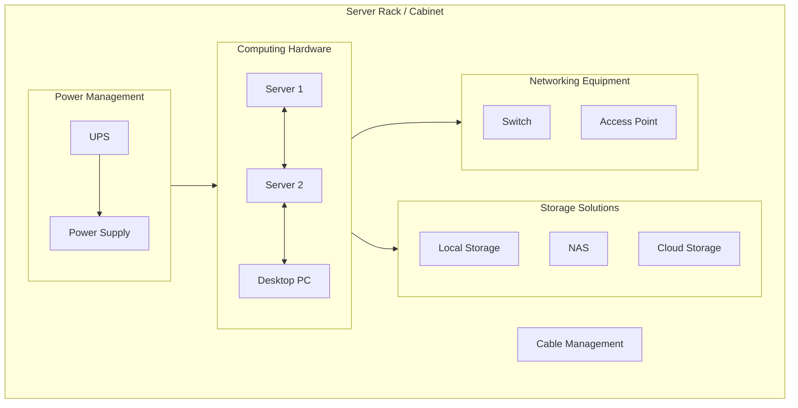

# Homelab For Begineers

Another week brings with it a new update on [Datahub.local](https://www.alvsanand.com/datahub-local/). In our previous post [Journey to Datahub.local](202401-journey-to-datahub-local.md), we saw a general overview of how I plan to execute this project with details about goals, steps and some rules. This time, we're delving into the realm of **Homelabs** or **Home Labs**.

!!! note

    In this article, I will exclusively concentrate on the hardware perspective. Subsequent topics to be covered in the future will include areas such as operating systems, bootstrapping, application orchestration, security, and more.

## What is a Homelab?

{ width="50%" }

If *Homelab* is as foreign word to you as a penguin in the desert, let me break it down for you. A Homelab is like having your own little tech playground at home – a server or a bunch of them where you can host any kind of applications and services.

Furthermore, a *Homelab* is a dedicated space where IT enthusiasts and professionals can experiment with various hardware and software configurations in a controlled environment. It's essentially a mini data center at home, providing a hands-on experience for learning, testing, and skill development.

## Why do you need a homelab?

You don't but setting up a Homelab is a powerful tool for personal and professional growth in the IT field. It allows you to:

- **Gain Practical Experience**: Homelabs provide a platform to apply theoretical knowledge in a real-world setting, helping you build confidence in your skills.
- **Test New Technologies**: Stay ahead of the curve by experimenting with the latest technologies and software without the fear of disrupting a production environment.
- **Enhance Troubleshooting Skills**: Encounter and resolve issues in a controlled environment, honing your ability to troubleshoot and debug problems effectively.

## Components

A well-rounded Homelab typically includes the following components:

Understanding how these components interact is essential for creating a functional and efficient Homelab.

### Computing Hardware

Compute infrastructure forms the backbone of a Homelab and typically includes servers and client machines. These can range from repurposed desktop computers to dedicated server hardware. These machines run various virtual machines or containers, enabling users to create and manage different computing environments.

- **Servers**: Dedicated server hardware, such as enterprise-grade servers, repurposed desktop computers, or rack-mounted servers. These servers run virtual machines or containers to create different computing environments.
- **Workstations**: High-performance desktops and laptops for various tasks, including development, testing, and running specific applications.
- **Microcontrollers**: Small devices like Raspberry Pi or Arduino for projects requiring low-power consumption or specialized functionalities.

### Networking Equipment

Networking components are needed for connecting the computing devices.

- **Routers**: Home routers for basic networking needs or enterprise-grade routers for more advanced configurations.
- **Switches**: Unmanaged switches for simple setups or managed switches for network customization and optimization.
- **Access Points**: Single-band or dual-band access points for wireless networking within the Homelab.

### Storage Solutions

Data is the essential aspect of any Homelab. Having a well-organized storage setup is key for running applications and storing the data. Therefore, choose storage solutions based on capacity and performance requirements.

- **Local Storage**: Hard disk drives (HDD) or solid-state drives (SSD) for storing data on individual servers or workstations.
- **Network-Attached Storage (NAS)**: Dedicated NAS devices or DIY NAS setups using software like FreeNAS to centralize storage.
- **Cloud Storage**: Utilizing cloud storage services such as AWS S3 or Google Cloud Storage for offsite backups or data sharing.

### Power Management

Ensuring a stable power to our devices is crucial for the reliability. Besides, we need also ways to protect against power outages and provide time to shut down equipment properly.

- **Power Supplies**: Standard ATX power supplies for individual components or redundant power supplies for servers.
- **Uninterruptible Power Supplies (UPS)**: Line-interactive or online UPS to protect against power outages and provide time for proper shutdown.

### Organization Tools

Using tools for organizing the rest of components is essential to have an efficient and tidy Homelab setup. hey help maximize space, improve airflow, and provide a structured environment for your components. Proper organization enhances accessibility and aesthetics.

- **Server Racks**: An open structure with vertical mounting rails, lacking side panels and doors. 
- **Cabinets**: An enclosed structure with side panels, front/rear doors, and often locking mechanisms. Provides additional security, protection from dust, and controlled airflow. Suitable for a neater appearance and reduced noise.
- **Cable Management**: Cable organizers and ties for maintaining a clean and organized cabling infrastructure.

## Cool Ideas for Your Homelab

Now that you have your Homelab set up, the possibilities are endless for exciting projects and experiments. Here are some cool ideas to spark your creativity:

- **Home Automation Hub**: Transform your Homelab into a central hub for home automation. Use platforms like Home Assistant or OpenHAB to control smart devices, set up routines, and experiment with IoT (Internet of Things) integrations.
- **Media Server**: Create a media server to centralize your music, movies, and TV shows. Platforms like Plex or Jellyfin allow you to organize and stream your media collection to various devices within your home network.
- **Private Cloud Services**: Explore self-hosted cloud services using tools like Nextcloud or ownCloud. Set up your private cloud for file storage, calendar, contacts, and more, providing an alternative to commercial cloud solutions.
- **Game Server Hosting**: Host your own game servers for popular titles or create a Minecraft server for you and your friends. It's a fun way to enjoy gaming while managing server configurations and networking.
- **Dockerized Applications**: Experiment with containerization using Docker. Deploy applications like WordPress, GitLab, or Grafana in containers, making it easy to manage, update, and scale your services.
- **DevOps Playground**: Turn your Homelab into a DevOps playground. Practice continuous integration and deployment (CI/CD) pipelines, container orchestration with Kubernetes, and explore infrastructure as code (IaC) with tools like Ansible or Terraform.
- **Network Monitoring**: Set up network monitoring tools such as Nagios, Prometheus, or Grafana to gain insights into your Homelab's performance. Monitor bandwidth, device health, and other metrics to enhance your networking skills.
- **Machine Learning Playground**: Explore machine learning and artificial intelligence in your Homelab. Set up Jupyter Notebooks, TensorFlow, or other ML frameworks to experiment with data analysis, model training, and predictive analytics.

## Tips to Create a Low-cost Homelab

Finally, I'll be sharing some tips for assembling your own Homelab without breaking the bank. Keep in mind that building a functional Homelab doesn't have to strain your finances. Here are some frugal tips to consider:

- **Reuse Old Hardware**: Give a new purpose to old computers and laptops by transforming them into servers or testing machines.
- **Buy Microcontrollers**: buy budget devices like Raspberry Pi, which not only come at a lower cost but can also serve for running small applications.
- **Open-source Software**: Leverage free and open-source software for virtualization, networking, and storage solutions.
- **Energy-efficient Components**: Opt for energy-efficient hardware to save on electricity costs.
- **Start small**: Familiarize yourself with the process through a small-scale project. As you gain more experience, you can advance to larger and more sophisticated setups.

## Conclusion

In summary, a Homelab proves to be a flexible resource for IT enthusiasts of all expertise levels. Whether you're a novice eager to delve into fundamentals or a seasoned professional aiming to stay abreast of cutting-edge technologies, a Homelab offers a dynamic and adaptable learning space. Begin modestly, and witness your Homelab expand in tandem with your IT proficiency.

Keep in mind that the crucial aspect is aligning your Homelab projects with your specific interests and objectives. Just make it **fun** and **enjoyable** so your **learning journey** will be a great success.
